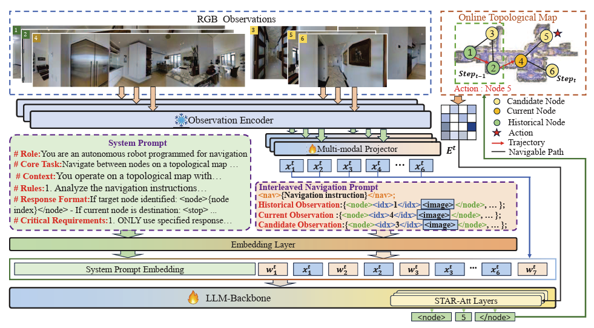

# TagaVLM: Topology-Aware Global Action Reasoning for Vision-Language Navigation

This is the official implementation of the paper **"TagaVLM: Topology-Aware Global Action Reasoning for Vision-Language Navigation"**.



## 🏠 Abstract

Vision-Language Navigation (VLN) presents a
unique challenge for Large Vision-Language Models (VLMs)
due to their inherent architectural mismatch: VLMs are
primarily pretrained on static, disembodied vision-language
tasks, which fundamentally clash with the dynamic, embodied,
and spatially-structured nature of navigation. Existing large-
model-based methods often resort to converting rich visual
and spatial information into text, forcing models to implicitly
infer complex visual-topological relationships or limiting their
global action capabilities. To bridge this gap, we propose
TagaVLM (Topology-Aware Global Action reasoning), an end-
to-end framework that explicitly injects topological structures
into the VLM backbone. To introduce topological edge infor-
mation, Spatial Topology Aware Residual Attention (STAR-Att)
directly integrates it into the VLM’s self-attention mechanism,
enabling intrinsic spatial reasoning while preserving pretrained
knowledge. To enhance topological node information, an In-
terleaved Navigation Prompt strengthens node-level visual-text
alignment. Finally, with the embedded topological graph, the
model is capable of global action reasoning, allowing for
robust path correction. On the R2R benchmark, TagaVLM
achieves state-of-the-art performance among large-model-based
methods, with a Success Rate (SR) of 51.09% and SPL of
47.18 in unseen environments, outperforming prior work by
3.39% in SR and 9.08 in SPL. This demonstrates that, for
embodied spatial reasoning, targeted enhancements on smaller
open-source VLMs can be more effective than brute-force model
scaling. The code will be released upon publication.

## 🛠️ Requirements

### 1. Installation

Clone the repository and set up the conda environment:

```bash
git clone https://github.com/APEX-BJUT/Taga-VLM.git
cd Taga-VLM

# Create environment
conda create -n tagavlm python=3.9 -y
conda activate tagavlm  

# Install dependencies
pip install --upgrade pip 
pip install -e ".[train]"
```

### 2. Install Modified Transformers

This project uses a specific version of transformers. Please install it from the local directory:

```bash
cd transformers-4.40.0
pip install -e .
cd ..
```

### 3. Additional Dependencies

Ensure the following versions are installed:

* `accelerate==0.28.0`
* `numpy<=2.0`

**Install Flash-Attention 2:**
We recommend installing `flash-attention` manually by downloading the wheel file to avoid build time issues.

1. Go to [Flash-Attention Releases](https://github.com/Dao-AILab/flash-attention/releases).
2. Download the appropriate `.whl` file for your CUDA version and Python version. **Important:** Select the version with `abiFALSE`.
3. Install via pip:
```bash
pip install flash_attn-*.whl
```


### 4. Simulator

Install the Matterport3D Simulator by following the instructions here: [Matterport3DSimulator](https://github.com/peteanderson80/Matterport3DSimulator).

## 📂 Data Preparation

Please download the model weights and datasets from [HuggingFace](https://www.google.com/search?q=https://huggingface.co/tiredtony).

Organize the files according to the following structure:

```text
Taga-VLM
├── data
│   ├── mp3d_pano_images
│   ├── mp3d_views
│   └── anno
├── model_zoo
│   ├── TagaVLM-7b
│   └── TagaVLM-0.5b

```

## 🚀 Training

To train the model, run the following script:

```bash
bash script/train/finetune_ov_test.sh
```

## ⚡ Evaluation

To evaluate the model on the R2R benchmark:

```bash
cd map_nav_src
./run_r2r.sh
```

## 🖊️ Citation

If you find this work useful in your research, please consider citing:

<!-- ```bibtex
@article{liu2026tagavlm,
  title={TagaVLM: Topology-Aware Global Action Reasoning for Vision-Language Navigation},
  author={Liu, Jiaxing and Zhang, Zexi and Li, Xiaoyan and Wang, Boyue and Hu, Yongli and Yin, Baocai},
  journal={arXiv preprint},
  year={2026}
}
``` -->

## 🙏 Acknowledgement

This project is built upon the excellent work of [LLaVA-NeXT](https://github.com/LLaVA-VL/LLaVA-NeXT) and [VLN-DUET](https://github.com/cshizhe/VLN-DUET). We thank the authors for open-sourcing their code.


