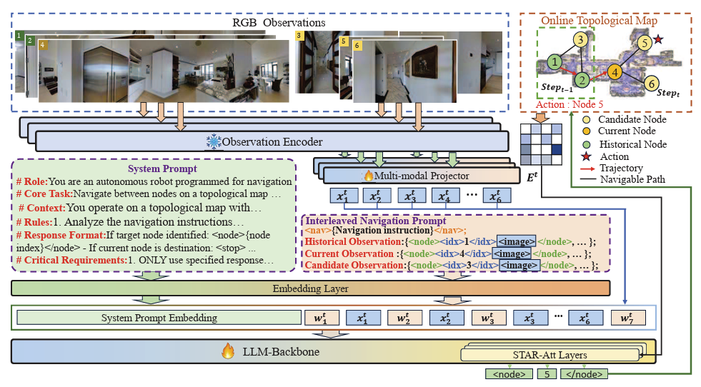

# TagaVLM: Topology-Aware Global Action Reasoning for Vision-Language Navigation

<p align="center">
  <a href="https://arxiv.org/abs/2603.02972"></a>
  <a href="https://apex-bjut.github.io/Taga-VLM/"></a>
  <a href="https://huggingface.co/tiredtony"></a>
  <a href="LICENSE"></a>
  
</p>

Official implementation of the ICRA 2026 paper **"TagaVLM: Topology-Aware Global Action Reasoning for Vision-Language Navigation"**.

For details, please visit our [project page](https://apex-bjut.github.io/Taga-VLM/).
【！！！】There are still some issues with the current training code, and we are fixing them as quickly as possible.


## Results on R2R (Val Unseen)

| Method | Backbone | NE ↓ | OSR ↑ | SR ↑ | SPL ↑ |
|--------|----------|------|-------|------|-------|
| NavCoT | LLaMA2-7B | 6.26 | 48.11 | 40.23 | 36.64 |
| MapGPT | GPT-4V | 5.62 | 57.9 | 47.7 | 38.1 |
| **TagaVLM-0.5B (Ours)** | Qwen2-0.5B | 5.57 | 55.09 | 45.72 | 41.91 |
| **TagaVLM-7B (Ours)** | Qwen2-7B | **4.97** | **60.2** | **51.09** | **47.18** |

## Installation

Requires [uv](https://docs.astral.sh/uv/) and Python 3.9-3.11.

```bash
git clone https://github.com/APEX-BJUT/Taga-VLM.git
cd Taga-VLM

# Inference only
uv sync

# Training (includes deepspeed, wandb, peft, etc.)
uv sync --extra train
```

This will create a `.venv`, install all dependencies, and build the patched transformers (required for STAR-Att) automatically.

**Flash-Attention 2 (optional):** Download the prebuilt `.whl` for your CUDA/Python version from [Flash-Attention Releases](https://github.com/Dao-AILab/flash-attention/releases) (select the `abiFALSE` variant), then:

```bash
uv pip install flash_attn-*.whl
```

**Matterport3D Simulator:** Follow [Matterport3DSimulator](https://github.com/peteanderson80/Matterport3DSimulator).

## Data Preparation

Download model weights and data from [HuggingFace](https://huggingface.co/tiredtony):

```bash
# Model weights
huggingface-cli download tiredtony/TagaVLM-qwen2-0.5b --local-dir model_zoo/TagaVLM-qwen2-0.5b
huggingface-cli download tiredtony/TagaVLM-qwen2-7b   --local-dir model_zoo/TagaVLM-qwen2-7b

# Dataset
huggingface-cli download tiredtony/TagaVLM_infer_data --repo-type dataset --local-dir data
```

Expected directory structure:

```text
Taga-VLM/
├── data/
│   ├── R2R/
│   │   ├── annotations/
│   │   └── connectivity/
│   ├── mp3d_data/
│   ├── view_images_bgr_from_mattersim.h5
│   ├── view_images_hm3d/
│   └── anno/
├── model_zoo/
│   ├── TagaVLM-qwen2-0.5b/
│   └── TagaVLM-qwen2-7b/
```

## Training & Evaluation

### Training

```bash
bash scripts/train/finetune_TagaVLM.sh
```

> **Note:** For the 0.5B model, add `"vocab_size": 151936` and `"tie_word_embeddings": true` to `config.json` after training.

### Evaluation

```bash
cd map_nav_src && bash run_r2r.sh
```

To switch between models, edit `model_zoo/TagaVLM-qwen2-*` path in `map_nav_src/r2r_llava/agent_base.py`. The spatial pool stride is read from each model's `config.json` (`mm_spatial_pool_stride`: 3 for 0.5B, 2 for 7B).

## Citation

```bibtex
@inproceedings{liu2026tagavlm,
  title     = {TagaVLM: Topology-Aware Global Action Reasoning for Vision-Language Navigation},
  author    = {Liu, Jiaxing and Zhang, Zexi and Li, Xiaoyan and Wang, Boyue and Hu, Yongli and Yin, Baocai},
  booktitle = {Proceedings of the IEEE International Conference on Robotics and Automation (ICRA)},
  year      = {2026}
}
```

## Acknowledgement

This project builds upon [LLaVA-NeXT](https://github.com/LLaVA-VL/LLaVA-NeXT) and [VLN-DUET](https://github.com/cshizhe/VLN-DUET). We thank the authors for open-sourcing their code.
